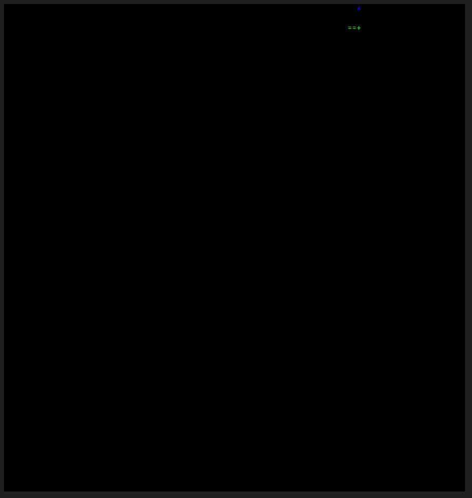
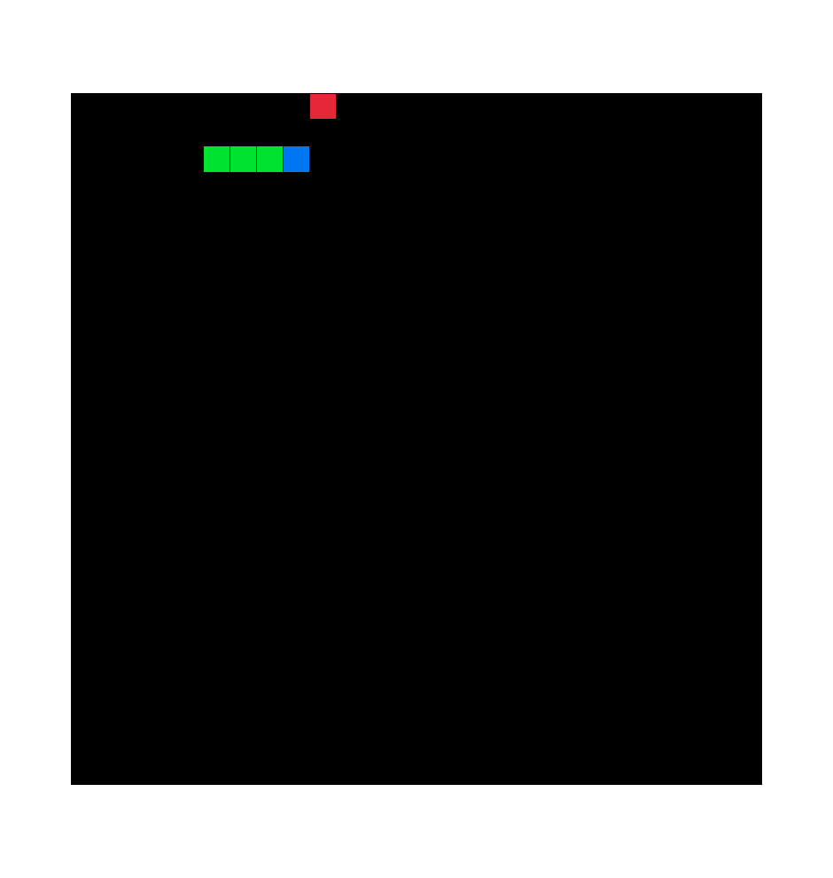

# Snake implemented in Rust

To run the terminal version made using [ruscii](https://github.com/lemunozm/ruscii).

[Watch the YouTube Demo](https://youtu.be/RHeQA1ISvE0)

## Terminal

```sh
cargo run --bin console_snake
```


Running in [Cool Retro Term](https://github.com/Swordfish90/cool-retro-term)

Asciinema example
[](https://asciinema.org/a/518501)

## GUI

To run the gui version made using [macroquad](https://github.com/not-fl3/macroquad).

```sh
cargo run --bin gui_snake
```


