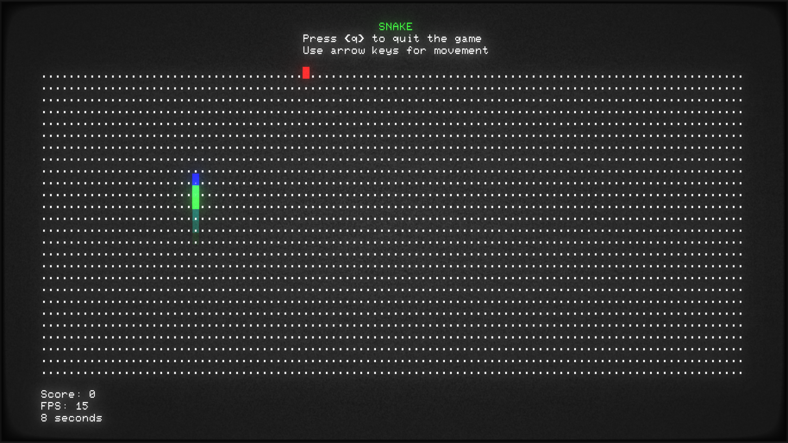

# Snake implemented in Rust

To run the terminal version made using [ruscii](https://github.com/lemunozm/ruscii).

```
cargo run --bin console_snake
```



To run the gui version made using [macroquad](https://github.com/not-fl3/macroquad).

```
cargo run --bin gui_snake
```


